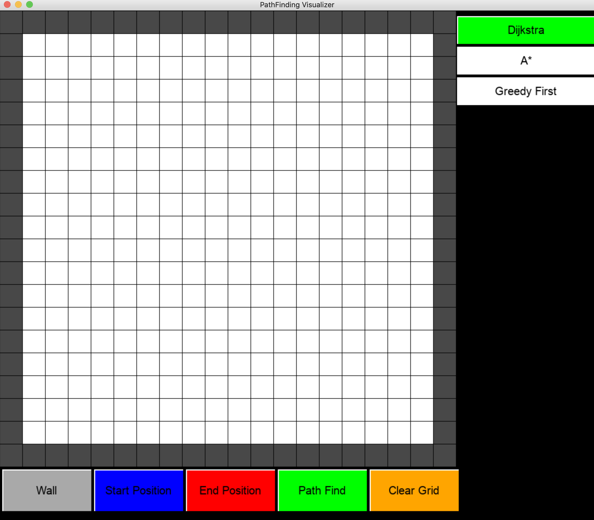

# Pathfinding Visualizer

### Pathfinding Visualizer is a tool to visualize 3 pathfinding algorithms: Dijkstra, A*, and Greedy Best First Search. This tool was built with the Pygame GUI library. 

- Users will be provided with a 20x20 grid with which they can place starting nodes, ending nodes, and obstacles (walls) and choose from the 3 algorithms to see in real-time the program attempting to find a path from the start node to the end node.
- This is the starting UI that you will see when opening up the application
- At the bottom are 5 buttons which will enable interaction with the program
- The wall button allows users to add walls to the grid which will act as an obstacle to the path finder
